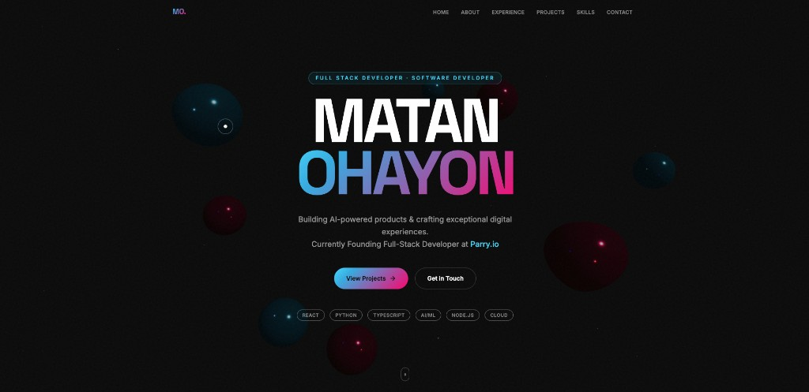
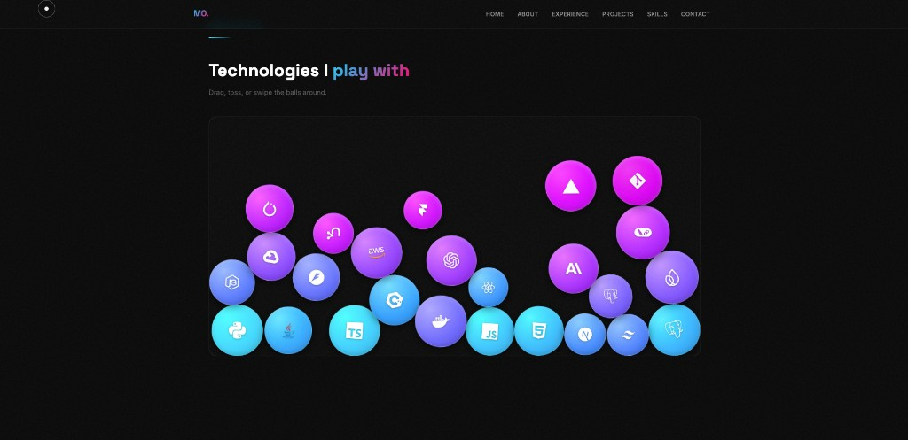

### 🌐 Matan Ohayon - Personal Portfolio
A modern, fully responsive portfolio website built with **React + Vite**, showcasing my projects, skills, and experience.  
Features immersive 3D visuals, physics-based interactions, smooth animations, and a polished UI — all crafted from scratch.

🔗 **Live Site:** [matans-portfolio.vercel.app](https://matans-portfolio.vercel.app/)

---

### ✨ Features
- 📱 **Responsive Design** — optimized for desktop & mobile  
- 🌌 **3D Floating Orbs** — interactive Three.js scene in the hero section  
- 🎯 **Interactive Skills Section** — drag, toss, and swipe physics-powered skill balls (Matter.js)  
- 🗂️ **Project Gallery** — bento-style cards with category filtering and modal previews  
- 🎞️ **Smooth Animations** — scroll effects, transitions, and hover interactions (Framer Motion + GSAP)  
- 🖱️ **Custom Cursor** — dynamic cursor that reacts to interactive elements  
- 🧈 **Smooth Scrolling** — buttery scroll experience powered by Lenis  
- ⚡ **High Performance** — powered by Vite with Tailwind CSS  
- 🔄 **Auto Deployment** — Vercel triggers a build on every push  

---

### 🛠️ Tech Stack

#### 🔧 Frontend
- React 19  
- Vite 7  
- JavaScript (ES6+)  
- Tailwind CSS 4  

#### 🎨 Animation & 3D
- Three.js + React Three Fiber  
- Framer Motion  
- GSAP  
- Matter.js  
- Lenis (smooth scroll)  

#### 🚀 Deployment & Tools
- Vercel  
- Git & GitHub  

---

### 📸 Screenshots

**Hero Section**


**Selected Works**


**Interactive Skills**


---

### ⚙️ Installation & Running Locally

Clone the repository:
```bash
git clone https://github.com/Matan1Ohayon/Matans-Portfolio.git
cd Matans-Portfolio
```
Install dependencies:
```bash
npm install
```
Run the development server:
```bash
npm run dev
```
Build for production:
```bash
npm run build
```

---

### 🚀 Deployment
This portfolio is deployed using **Vercel**.  
Every push to the main branch automatically triggers a production deployment.

---

### 📬 Contact

- 🌐 Portfolio: https://matans-portfolio.vercel.app/ 
- 💼 LinkedIn: www.linkedin.com/in/matan-ohayon-4101b6276
- 📧 Email: matan1ohayon@gmail.com  